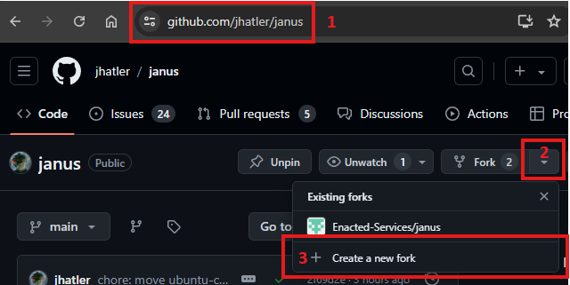
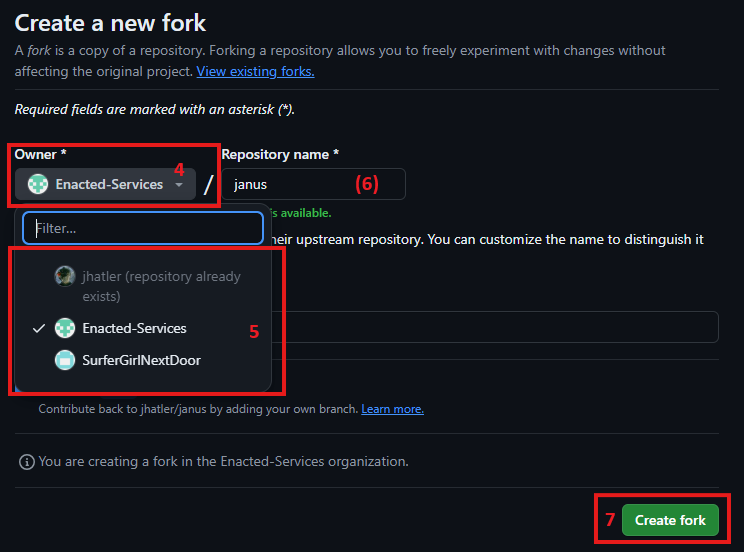
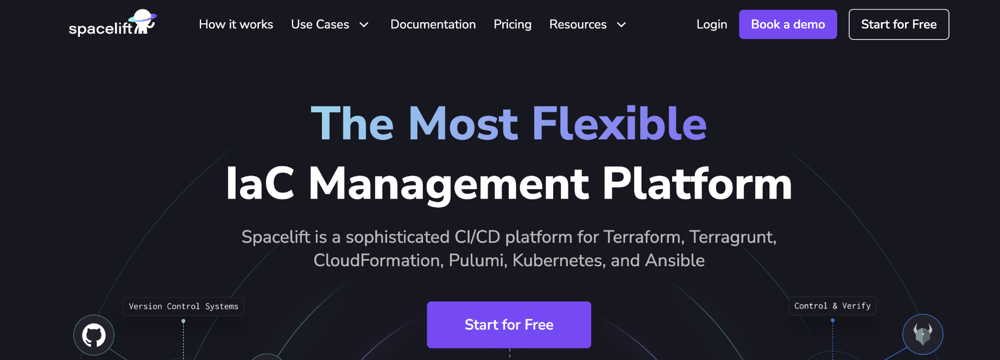
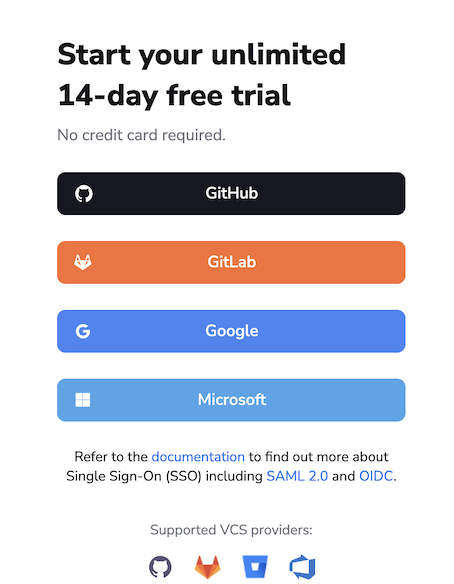
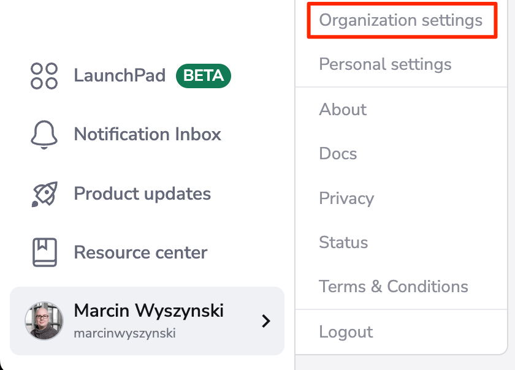
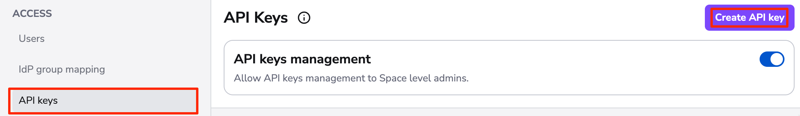
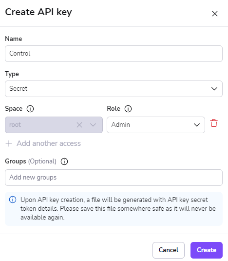
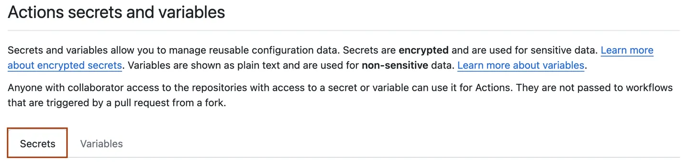
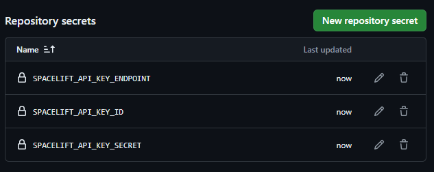
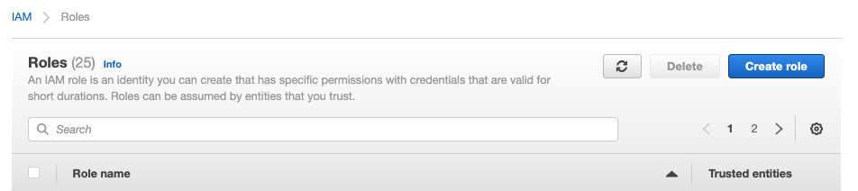

# Project Janus Forking and Setup

A GitHub account is needed to begin. This can be a personal account, but a dedicate service account is recommended for production workloads. For help on this, see [Creating an account on GitHub](https://docs.github.com/en/get-started/start-your-journey/creating-an-account-on-github).

## Forking the project

Forking the [Project Janus repository](https://github.com/jhatler/janus) is needed in order to configure it for a new deployment. There is a 1:1 relationship between repositories and deployments.

1. Go to [https://github.com/jhatler/janus](https://github.com/jhatler/janus).
2. Click the drop down on the `Fork` button.
3. Click the `Create a new fork` button next to the `+` symbol



4. Click the drop down under `Owner`.
5. Select an Organization or Account to own the fork.
6. (Optional) Choose a different name for the fork.
7. Click the green `Create fork` button.



## Setting up AWS

Project Janus makes heavy use of Amazon Web Services. It can be deployed on any AWS Account, but currently it's not possible to deploy more than once instance per account. For this reason, it's recommended to dedicate an AWS Account exclusively to each deployment of Project Janus. For instructions on how to create an AWS Account, see [Create a standalone AWS account](https://docs.aws.amazon.com/accounts/latest/reference/manage-acct-creating.html).

Managing one or two AWS accounts to maintain separate deployments is somewhat trivial. For anything more complex than that, it is recommended to turn the standalone AWS account into an [AWS Organization](https://docs.aws.amazon.com/organizations/latest/userguide/orgs_introduction.html) by deploying [AWS Control Tower](https://docs.aws.amazon.com/controltower/latest/userguide/what-is-control-tower.html). See the instructions in the next section for details on how to do this, otherwise proceed to [Setting Up Spacelift](#setting-up-spacelift)

### Setting up AWS Control Tower

AWS has documented [Getting started with AWS Control Tower from the console](https://docs.aws.amazon.com/controltower/latest/userguide/getting-started-from-console.html), but before following those steps please take a moment to read the following notes.

* Besides the email for the standalone AWS account, this deployment option requires (at least) 3 more emails for:
  * The Audit account.
  * The Log archive account.
  * The account to which you will deploy Project Janus.
* Each account provisioned with AWS Control Tower will have a root user that will need properly secured (as with any other AWS Account).
* All billing rolls up to the top-level AWS Account with this deployment option.

> [!TIP]
> A single Gmail account can support multiple AWS Accounts using [plus addressing](https://gmail.googleblog.com/2008/03/2-hidden-ways-to-get-more-from-your.html).

Once you have setup AWS Control Tower, be sure to review the suggested [Next steps](https://docs.aws.amazon.com/controltower/latest/userguide/getting-started-next.html). Specifically:

- [Best practices for AWS Control Tower administrators](https://docs.aws.amazon.com/controltower/latest/userguide/best-practices.html).
- [Configuration update management in AWS Control Tower](https://docs.aws.amazon.com/controltower/latest/userguide/configuration-updates.html)
- [AWS Control Tower on YouTube](https://www.youtube.com/playlist?list=PLhr1KZpdzukdS9skEXbY0z67F-wrcpbjm)


Finally, follow the instructions in [Provision accounts with AWS Service Catalog Account Factory](https://docs.aws.amazon.com/controltower/latest/userguide/provision-as-end-user.html) to provision an account to which you will deploy your fork. Once provisioned, sign into it from your user portal URL.

## Setting up Spacelift

Spacelift's own documentation on [Getting Started](https://docs.spacelift.io/getting-started) is excellent, but covers more information than is needed to get Project Janus setup given it's ability to self-host. Start by creating a Spacelift account and connect it to your fork:

On the [Spacelift home page](https://spacelift.io/), click on the `Start for Free` button:



Select from the options available to create your Spacelift account:

> [!NOTE]
> If you sign up with GitHub, the GitHub Organization/account name selected will be used as your Spacelift account name.



> [!IMPORTANT]
> If you attempt to sign up with a Microsoft account you will receive a message indicating that you need admin approval unless Spacelift has already been approved for your Entra ID tenant. Dee [this Spacelift FAQ](https://docs.spacelift.io/faq#providing-admin-consent-for-microsoft-login) for more information.

If you created your Spacelift account using GitHub, you will need to [Install the Spacelift GitHub App](https://github.com/apps/spacelift-io/installations/new). Select your fork from the list of repositories when presented with the option. If you are asked to name the integration, use `Control`.

If you created your Spacelift account using a means other than GitHub, follow the guide for [setting up the GitHub integration](https://docs.spacelift.io/integrations/source-control/github#setting-up-the-integration). Again, select your fork from the list of repositories when presented with the option. If you are asked to name the integration, use `Control`.

> [!WARNING]
> While you can run multiple forks from a single Spacelift account, they must all share the same GitHub integration named `Control`.

Now that the VCS integration is configured, click on the lower right hand corner menu and select the `Organization settings` menu item.



From the `Access` menu on the left hand side of the screen, select the `API keys` item, and click the `Create API key` button as shown below:



Create an Admin API key matching the settings below. This API key will be used by the GitHub Actions workflows in your fork.



Once you click the Add Key button, the API Key will be generated and a file will be automatically downloaded. The file contains the API token in two forms - one to be used with their API, and the other one as a .terraformrc snippet to access your private modules outside of Spacelift.

We are only interested in the form used to access their API. Open the generated file so you have the the API Key ID (visible in the browser) and secret ready for use in the next section.

## Authorizing your fork to administer Spacelift

The Spacelift API key generated in the previous section will be used to authorize your fork to administer Spacelift. This is done by adding the API key to the GitHub repository secrets.

1. Navigate to the main page of your fork on GitHub.
2. Under your repository name, click **<svg version="1.1" width="16" height="16" viewBox="0 0 16 16" class="octicon octicon-gear" aria-hidden="true"><path d="M8 0a8.2 8.2 0 0 1 .701.031C9.444.095 9.99.645 10.16 1.29l.288 1.107c.018.066.079.158.212.224.231.114.454.243.668.386.123.082.233.09.299.071l1.103-.303c.644-.176 1.392.021 1.82.63.27.385.506.792.704 1.218.315.675.111 1.422-.364 1.891l-.814.806c-.049.048-.098.147-.088.294.016.257.016.515 0 .772-.01.147.038.246.088.294l.814.806c.475.469.679 1.216.364 1.891a7.977 7.977 0 0 1-.704 1.217c-.428.61-1.176.807-1.82.63l-1.102-.302c-.067-.019-.177-.011-.3.071a5.909 5.909 0 0 1-.668.386c-.133.066-.194.158-.211.224l-.29 1.106c-.168.646-.715 1.196-1.458 1.26a8.006 8.006 0 0 1-1.402 0c-.743-.064-1.289-.614-1.458-1.26l-.289-1.106c-.018-.066-.079-.158-.212-.224a5.738 5.738 0 0 1-.668-.386c-.123-.082-.233-.09-.299-.071l-1.103.303c-.644.176-1.392-.021-1.82-.63a8.12 8.12 0 0 1-.704-1.218c-.315-.675-.111-1.422.363-1.891l.815-.806c.05-.048.098-.147.088-.294a6.214 6.214 0 0 1 0-.772c.01-.147-.038-.246-.088-.294l-.815-.806C.635 6.045.431 5.298.746 4.623a7.92 7.92 0 0 1 .704-1.217c.428-.61 1.176-.807 1.82-.63l1.102.302c.067.019.177.011.3-.071.214-.143.437-.272.668-.386.133-.066.194-.158.211-.224l.29-1.106C6.009.645 6.556.095 7.299.03 7.53.01 7.764 0 8 0Zm-.571 1.525c-.036.003-.108.036-.137.146l-.289 1.105c-.147.561-.549.967-.998 1.189-.173.086-.34.183-.5.29-.417.278-.97.423-1.529.27l-1.103-.303c-.109-.03-.175.016-.195.045-.22.312-.412.644-.573.99-.014.031-.021.11.059.19l.815.806c.411.406.562.957.53 1.456a4.709 4.709 0 0 0 0 .582c.032.499-.119 1.05-.53 1.456l-.815.806c-.081.08-.073.159-.059.19.162.346.353.677.573.989.02.03.085.076.195.046l1.102-.303c.56-.153 1.113-.008 1.53.27.161.107.328.204.501.29.447.222.85.629.997 1.189l.289 1.105c.029.109.101.143.137.146a6.6 6.6 0 0 0 1.142 0c.036-.003.108-.036.137-.146l.289-1.105c.147-.561.549-.967.998-1.189.173-.086.34-.183.5-.29.417-.278.97-.423 1.529-.27l1.103.303c.109.029.175-.016.195-.045.22-.313.411-.644.573-.99.014-.031.021-.11-.059-.19l-.815-.806c-.411-.406-.562-.957-.53-1.456a4.709 4.709 0 0 0 0-.582c-.032-.499.119-1.05.53-1.456l.815-.806c.081-.08.073-.159.059-.19a6.464 6.464 0 0 0-.573-.989c-.02-.03-.085-.076-.195-.046l-1.102.303c-.56.153-1.113.008-1.53-.27a4.44 4.44 0 0 0-.501-.29c-.447-.222-.85-.629-.997-1.189l-.289-1.105c-.029-.11-.101-.143-.137-.146a6.6 6.6 0 0 0-1.142 0ZM11 8a3 3 0 1 1-6 0 3 3 0 0 1 6 0ZM9.5 8a1.5 1.5 0 1 0-3.001.001A1.5 1.5 0 0 0 9.5 8Z"></path></svg> Settings**. If you cannot see the **Settings** tab, select the <svg version="1.1" width="16" height="16" viewBox="0 0 16 16" class="octicon octicon-kebab-horizontal" aria-label="More" role="img"><path d="M8 9a1.5 1.5 0 1 0 0-3 1.5 1.5 0 0 0 0 3ZM1.5 9a1.5 1.5 0 1 0 0-3 1.5 1.5 0 0 0 0 3Zm13 0a1.5 1.5 0 1 0 0-3 1.5 1.5 0 0 0 0 3Z"></path></svg> dropdown menu, then click **Settings**.


3. In the **Security** section of the sidebar, select **<svg version="1.1" width="16" height="16" viewBox="0 0 16 16" class="octicon octicon-key-asterisk" aria-hidden="true"><path d="M0 2.75A2.75 2.75 0 0 1 2.75 0h10.5A2.75 2.75 0 0 1 16 2.75v10.5A2.75 2.75 0 0 1 13.25 16H2.75A2.75 2.75 0 0 1 0 13.25ZM2.75 1.5c-.69 0-1.25.56-1.25 1.25v10.5c0 .69.56 1.25 1.25 1.25h10.5c.69 0 1.25-.56 1.25-1.25V2.75c0-.69-.56-1.25-1.25-1.25Z"></path><path d="M8 4a.75.75 0 0 1 .75.75V6.7l1.69-.975a.75.75 0 0 1 .75 1.3L9.5 8l1.69.976a.75.75 0 0 1-.75 1.298L8.75 9.3v1.951a.75.75 0 0 1-1.5 0V9.299l-1.69.976a.75.75 0 0 1-.75-1.3L6.5 8l-1.69-.975a.75.75 0 0 1 .75-1.3l1.69.976V4.75A.75.75 0 0 1 8 4Z"></path></svg> Secrets and variables**, then click **Actions**.
4. Click the **Secrets** tab.



5. Click **New repository secret** and add the following secrets. Use the bolded text as the secret name and the specified information as the secret value.
    * **SPACELIFT_API_KEY_ENDPOINT** - The endpoint for the Spacelift API. This is the URL you use to access the Spacelift web interface (e.g. `https://enacted.app.spacelift.io`).
    * **SPACELIFT_API_KEY_ID** - The ID of the Spacelift API key you generated.
    * **SPACELIFT_API_KEY_SECRET** - The secret of the Spacelift API key you generated, from the downloaded file.

Once you have added these secrets, the list should look like this:



## Authorizing your fork to administer GitHub

Similar to the Spacelift API key, a GitHub fine-grained Personal Access Token (PAT) is needed to authorize your fork to administer its own repository.

To create a fine-grained PAT, follow these steps:

1. Go to [https://github.com/settings/personal-access-tokens/new](https://github.com/settings/personal-access-tokens/new).
2. Name the token and set the expiration to the length of time you feel comfortable with.
3. Specify the Owner of your fork and restrict the repository access to only the fork you created.
4. Grant the maximum permission level for each Repository permission.
5. Click the `Generate token` button at the bottom of the page.
6. Copy the token to your clipboard.
7. Follow the steps in the previous section to add the following secret to your fork:
     * **CONTROL_TOKEN** - The fine-grained PAT you generated.
     * **CONTROL_PREFIX** - If you are only deploying one instance of Project Janus, set this to `@`. If you are deploying multiple instances, set this to a unique value for each instance following the format `instanceName@`.
     * **CONTROL_ONLINE** - Set this to `false`. It will be updated to `true` by the bootstrapping process.

## Authorizing your fork to administer AWS

At this point, the fork is authorized to administer Spacelift and GitHub.

The next step is to authorize Spacelift to administer AWS. You will need to decide on a default region for your deployment. This will be in a form similar to `us-east-2` or `eu-west-1`.

Create a repository secret in your fork on GitHub with the name `AWS_DEFAULT_REGION` and the value you selected. While you are there, create another repository secret with the name `AWS_ACCOUNT_ID` and the value of the AWS Account ID you are using. This can be found in the AWS Management Console by clicking on your name in the top right corner. Adding the account ID as a secret helps to ensure that it is not accidentally exposed in logs or other places. Keep your account ID handy for use in the next steps.

Next, we need to create an [AWS IAM Role](https://docs.aws.amazon.com/IAM/latest/UserGuide/id_roles.html). This role is used by the Control stack and some GitHub Actions workflows. Other less-privileged roles and policies are created for use by child stacks and actual workloads.

To create the control role, navigate to AWS IAM and click the `Create role` button.



We want to configure the [Trust Policy](https://docs.aws.amazon.com/IAM/latest/UserGuide/id_roles_create_for-custom.html) so that only the Control Stack in Spacelift and your fork's GitHub Actions workflows can assume it.

For that, use the trust policy below, replacing the following placeholders with the described values:

- `$yourSpaceliftAccountName` - The name of your Spacelift account.
- `$yourForkRepoOwner` - The owner of your fork.
- `$yourForkRepoName` - The name of your fork.
- `$yourAwsAccountId` - The AWS Account ID you are using.

```json
{
  "Version": "2012-10-17",
  "Statement": [
    {
      "Action": "sts:AssumeRole",
      "Condition": {
        "StringLike": {
          "sts:ExternalId": "$yourSpaceliftAccountName@*@*atcontrol@*"
        }
      },
      "Effect": "Allow",
      "Principal": {
        "AWS": "324880187172"
      },
      "Sid": "AllowSpaceliftControl"
    },
    {
      "Action": "sts:AssumeRoleWithWebIdentity",
      "Condition": {
        "StringLike": {
          "token.actions.githubusercontent.com:sub": "repo:$yourForkRepoOwner/$yourForkRepoName:*"
        },
        "StringEquals": {
          "token.actions.githubusercontent.com:aud": "sts.amazonaws.com"
        }
      },
      "Effect": "Allow",
      "Principal": {
        "Federated": "arn:aws:iam::$yourAwsAccountId:oidc-provider/token.actions.githubusercontent.com"
      },
      "Sid": "AllowGithubControl"
    }
  ]
}
```

Next, attach the `AdministratorAccess` policy to the IAM Role which will provide it with sufficient permissions to create other roles and policies capable of administering the account.

To finish creating the IAM Role, provide it a name of `control` and a description before clicking the `Create role` button.

At this point, the role could be assumed by Spacelift but the GitHub Actions workflows in your fork will not be able to assume it. To enable this, we need to create an [AWS IAM OpenID Connect Provider](https://docs.aws.amazon.com/IAM/latest/UserGuide/id_roles_providers_create_oidc.html).

Navigate to the AWS IAM console and click `Identity providers` in the left hand menu. Click the `Add provider` button.

Select `OpenID Connect` as the provider type and use the following values for the provider URL and audience:

Provider URL: `https://token.actions.githubusercontent.com`
Audience: `sts.amazonaws.com`

Click the `Add provider` button to create the provider, then open the provider and click the `Endpoint verification` tab. Click `Manage` and then update the thumbprint to `ffffffffffffffffffffffffffffffffffffffff` before clicking `Save changes`.

## Connecting Aikido to your fork

Follow [these instructions](https://help.aikido.dev/doc/create-account-and-connect-your-repositories/docl53EfjBNi) to create an Aikido account and connect it to your fork.

Once you have connected Aikido to your fork, you will need to generate an Aikido CI token. This can be done by [going here](https://app.aikido.dev/settings/integrations/continuous-integration) and where you will see the option to generate a new token (if you have not already). Copy the token when it is displayed.

Create a repository secret in your fork on GitHub with the name `AIKIDO_SECRET_KEY` and the value you copied.

## Connecting Infracost to your fork

Begin by signing up for an Infracost account if you do not already have one. You can do this by visiting [Infracost](https://www.infracost.io/) and clicking the `Sign up / Log in` button.

Once you have signed up, you will be taken to the Infracost dashboard. Click the `Org Settings` button in the top right corner of the screen. This will take you to the Organization Settings page.

On the Organization Settings page, click `API tokens` on the sidebar. There you will see a field with text `Click to show`. Click this the `Copy` button on the right side of that field and not the field itself.

Create a repository secret in your fork on GitHub with the name `INFRACOST_API_KEY` and the value you copied from the Infracost dashboard.

## Configuring the network

A new VPC will be created into which all resources will be deployed. In order to support peering with other deployments in the future, you should ensure that each deployment ends up in a different CIDR block.

To configure the network, create a repository secret in your fork on GitHub with the name `CONTROL_CIDR_PREFIX` and a value that is unique to your deployment. For example, if you are deploying a single instance, you could use `10.0` as the value. If you are deploying multiple instances, you could use `10.0` and `10.1` as the values.
